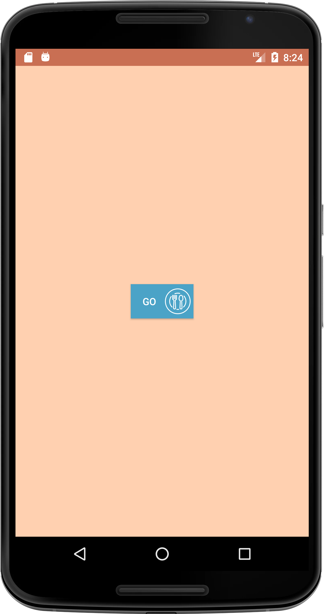
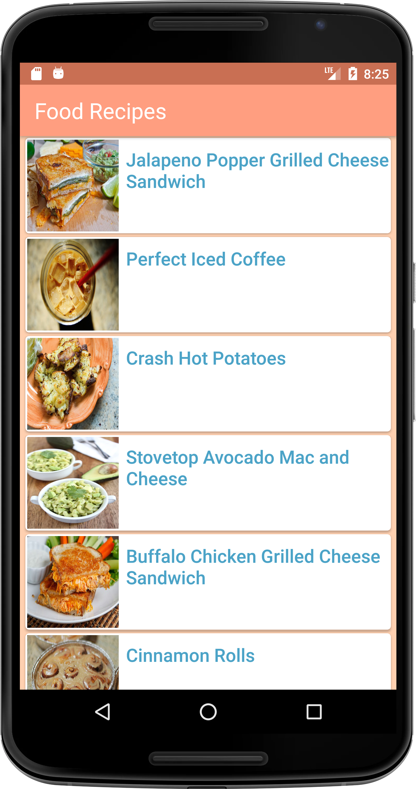

# App Description
The app uses 
1. Food2Fork API to get a list of recipes.
2. MVVM architecture pattern.

More information about the API can be found [here](http://food2fork.com/about/api)

Please register to get your own API key and then add the key in gradle.properties file with this format
```
API_KEY ="your_api_key"
``` 
Add your own gradle.properties file if not there in the repo.

App tested on - Nexus 6 API 23 emulator, Redmi4 Android 6.0 device

### Libraries used in the Project

- [Retrofit Networking Library](http://square.github.io/retrofit/)
- [Live Data](https://developer.android.com/topic/libraries/architecture/livedata)
- [View Model](https://developer.android.com/topic/libraries/architecture/viewmodel)
- [OkHttp Interceptors](https://github.com/square/okhttp/wiki/Interceptors)
- [Picasso](http://square.github.io/picasso/)
- [ButterKnife](http://jakewharton.github.io/butterknife/)

### Screenshots

Launch Screen | RecipeListFragment
--- | ---
 | 

### License

This project is submitted by Henna Singh as a part of Android Challenge

Copyright (c) 2018 Henna Singh
```
MIT License

Permission is hereby granted, free of charge, to any person obtaining a copy
of this software and associated documentation files (the "Software"), to deal
in the Software without restriction, including without limitation the rights
to use, copy, modify, merge, publish, distribute, sublicense, and/or sell
copies of the Software, and to permit persons to whom the Software is
furnished to do so, subject to the following conditions:

The above copyright notice and this permission notice shall be included in all
copies or substantial portions of the Software.

THE SOFTWARE IS PROVIDED "AS IS", WITHOUT WARRANTY OF ANY KIND, EXPRESS OR
IMPLIED, INCLUDING BUT NOT LIMITED TO THE WARRANTIES OF MERCHANTABILITY,
FITNESS FOR A PARTICULAR PURPOSE AND NONINFRINGEMENT. IN NO EVENT SHALL THE
AUTHORS OR COPYRIGHT HOLDERS BE LIABLE FOR ANY CLAIM, DAMAGES OR OTHER
LIABILITY, WHETHER IN AN ACTION OF CONTRACT, TORT OR OTHERWISE, ARISING FROM,
OUT OF OR IN CONNECTION WITH THE SOFTWARE OR THE USE OR OTHER DEALINGS IN THE
SOFTWARE.
```

